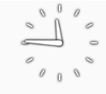

<h1>Assignment 2: Analog Clock</h1>

<h2>Introduction</h2>

The subject of my assignment is the Analog Clock Widget. The widget displays the hour and minute in a analog clock format with two hands. The background colour can be changed for the AnalogClock view.

<h2>History</h2>

  The AnalogClock widget was first released with Android API level 1 in October 2008 and was deprecated with API level 23 on October 25. The widget belongs to the android.widget library at android.widget.AnalogClock. 
  
  

<h2>Methods & Attributes</h2>

<h2>Sample Code</h2>

<h2>References</h2>
<ol>
  <li></li>
  <li></li>
  <li></li>
  <li></li>
</ol>

